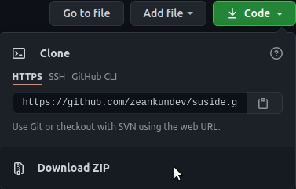

A fully fledged text editor built with Electron.
Flexible, minimal and comfortable text editor.
<br>


## What does it do? 
Suside is a code editor which can do in a normal editor, but there are
differences that made Suside unique.

The following features that made Suside unique are
* Built-in HTML previewer. This feature doesn't exist in other code editor and Suside has one to preview it without going into your browser for debugging.
* Console. Other code editors don't have one except IDEs. 
Here, Suside provides a console without going into your
terminal for debugging.
* Discord Rich Presence. Other code editors require you to install third-party extensions for Discord Rich Presence to see what you are working. In Suside, you don't need a third-party extension to do Discord Rich Presence, because it is built-in!

## Usage
To get started, you must have the following.
* Node.js version 7.9
* Git
* npm version 1.0.x
* Electron 13.1.17
* Python 3.9.6

I have tested this on my local Linux machine (Mint). This build method is only for Windows and Linux (I don't have the build process for macOS, or is it the same?)

Next, you got to clone the repository, change the directory to suside, and installing all dependencies. There are 2 methods.
### Method 1 (The easy way but a little bit hard)
1. Go to this repository and find the Code button.
2. Make sure to click Download ZIP as shown.



3. Go to your terminal and type the ```cd``` command along with the directory on where you extracted Suside.

**NOTE: You must extract the entire Suside ZIP file before continuing to Step 3.**

Let's say I extracted in my home directory. So, I have to type this.
```shell
cd /home/user/suside-master
```
For the path, you must PROVIDE the full path. If you extract in your home directory, you just only enter ```cd suside-master```.

After you enter the repository that you just extracted, you can install the dependencies and run it.

### Method 2 (The quick and fast way, but irritating for beginners.)
To quickly just only clone at your current directory, just type the following commands.
```shell
# Clone the repository
$ git clone https://github.com/zeankundev/suside
# Change it to suside on where we clone it
$ cd suside
# Installing all dependencies
$ npm install
```

Now, this is where all the fun begins. Type this line in your terminal after installing all the dependencies.
```shell
$ npm start
```
Have fun hacking on Suside! 🥳:tada:

## Script References

These are references for scripts to do certain commands. Here are some list. Just run ```npm run <script>```
* ```buildwin``` - Makes the Windows version of Suside. Output is on the ```build``` folder
* ```buildmac``` - Makes the Mac version of Suside. Output is still in the ```build``` folder
* ```buildlinux``` - Makes the Linux version of Suside. Output is still in the ```build``` folder
* ```builddeb``` - Compiles the Linux version of Suside into a .deb formate. You have to run ```buildlinux``` command before running this.
